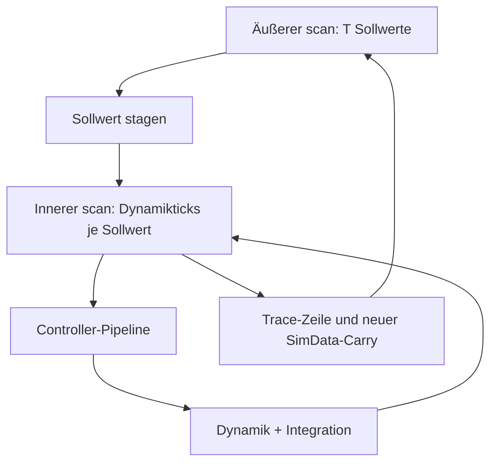

# Technischer Code-Walkthrough

Status: 2026-07-26  
Gültiger Forschungsstand: Sprint 3, eingefroren und in Sprint 4 ausschließlich auditiert  
Repository: `/home/noah3/bachelorarbeit/crazyflow-gradient-research`

## 1. Forschungsziel und Nicht-Ziele

Der Prototyp untersucht, ob sich ein normierter Trajektorien-Tracking-Loss durch den reinen
JAX-Mellinger-Regler und die reinen JAX-First-Principles-Dynamikmodelle von Crazyflow bis zu vier
Positions- und Geschwindigkeits-Gains zurückdifferenzieren lässt. Diese vier Größen sind
`kp_xy`, `kp_z`, `kd_xy` und `kd_z`. Der wissenschaftliche Stand und die zugehörigen Pfade sind in
[`DAY3_CHECKPOINT.md`](checkpoints/DAY3_CHECKPOINT.md) und
[`optimization_result.json`](../../artifacts/day3-audit/optimize-h200/optimization_result.json)
festgehalten.

Nicht untersucht wurden Hardwareflug, Firmwaregleichheit, Sensorik, Verzögerungen, Störungen,
Batterieeffekte, Aerodynamikvariation, Estimator-in-the-loop, UKF, native Brücken, BetaFlight oder
TinyMPC. Der ausgewählte Parametersatz ist deshalb das **beste getestete Train-Checkpoint des
festgelegten H200-Laufs** und ein **simulationsoptimierter Gain-Kandidat**, aber keine
Hardwarefreigabe und kein Nachweis eines allgemein überlegenen Reglers. Quelle der Abgrenzung:
[`DAY3_CHECKPOINT.md`](checkpoints/DAY3_CHECKPOINT.md#scientific-limitations).

## 2. Repositorykarte

| Pfad | Rolle |
|---|---|
| [`crazyflow/trajectory.py`](../../crazyflow/trajectory.py) | Analytische Kreis- und Figure-8-Referenzen sowie Umwandlung in Zustands-Sollwerte |
| [`tracking.py`](../../crazyflow/control/mellinger/tracking.py) | Gain-Abbildung, Initialisierung, äußerer Rollout-Scan, Loss und Metriken |
| [`optimization.py`](../../crazyflow/control/mellinger/optimization.py) | Train-only-Ziel, Adam-Schritt, Auswertung, Massenersetzung und Checkpointwahl |
| [`mellinger/__init__.py`](../../crazyflow/control/mellinger/__init__.py) | Öffentliche Re-Exports; enthält keine eigene Funktion |
| [`mellinger_tracking.py`](../../examples/jax/mellinger_tracking.py) | Tag-1-Einzelfall, Gradientenprüfung und Plot/JSON |
| [`mellinger_batch_diagnostics.py`](../../examples/jax/mellinger_batch_diagnostics.py) | Tag-2-Batch-, Masken-, Sensitivitäts- und Profilingdiagnostik |
| [`mellinger_gain_optimization.py`](../../examples/jax/mellinger_gain_optimization.py) | Tag-3-Adam-Lauf, Checkpointdiagnostik, Robustheitsmatrix und Profiling |
| [`test_mellinger_tracking.py`](../../tests/unit/test_mellinger_tracking.py) | Tag-1-Relationstests |
| [`test_mellinger_batch_diagnostics.py`](../../tests/unit/test_mellinger_batch_diagnostics.py) | Tag-2-Batch- und Evidenztests |
| [`test_mellinger_gain_optimization.py`](../../tests/unit/test_mellinger_gain_optimization.py) | Tag-3-Optimierungs- und Robustheitstests |
| [`mellinger-gradient-rollout.md`](../user-guide/mellinger-gradient-rollout.md) | Bestehende englische Nutzerbeschreibung |
| [`RUNBOOK.md`](RUNBOOK.md) | Autoritative Kommandos und Umgebung |
| [`PROJECT_STATE.md`](PROJECT_STATE.md) | Autoritativer Forschungsstatus |

## 3. End-to-End-Datenfluss

```mermaid
flowchart LR
    A["Analytischer Punkt bei t_k"] --> B["Trajectory: pos, vel, acc, yaw, yaw_rate"]
    B --> C["state_commands: 13 Felder"]
    C --> D["Commands (T,N,M,13)"]
    D --> E["F.state_control"]
    E --> F["Mellinger: State → Attitude → Force/Torque → Rotor-RPM"]
    F --> G["First-Principles-Dynamik"]
    G --> H["RolloutTrace (T,N,M,…)"]
    H --> I["Loss pro Welt"]
    I --> J["Train-Loss = Welt 0"]
    J --> K["value_and_grad"]
    K --> L["Gradient im rohen Gain-Raum"]
    L --> M["Optax Adam"]
```



Der Referenzgenerator liefert analytisch Position, Geschwindigkeit und Beschleunigung. Aus diesen
Feldern entsteht ein Sollwertvektor. `F.state_control` legt ihn zunächst im Staging-Puffer ab.
Danach führt die aus `Sim.build_step_fn()` erzeugte reine Funktion Controller und Dynamik aus.
`rollout_state_commands` sammelt die wichtigsten Zustände und Befehle in einem `RolloutTrace`.
`tracking_loss_per_case` berechnet je Welt einen dimensionslosen Loss; nur der Figure-8-Wert der
ersten Welt wird von Adam differenziert. Die nachgewiesene konkrete Anordnung und alle
Zahlenangaben dieses Abschnitts stammen aus
[`optimization_result.json`](../../artifacts/day3-audit/optimize-h200/optimization_result.json)
und [`DAY3_CHECKPOINT.md`](checkpoints/DAY3_CHECKPOINT.md#optimization-design).

## 4. `T`, `N`, `M`, Shapes und Einheiten

`T` bezeichnet die Zahl der Regelintervalle, `N` die Zahl unabhängiger Simulationswelten und `M`
die Drohnen je Welt. Im gemeinsamen Tag-2-/Tag-3-Batch gelten `N=2` und `M=1`; einzelne
Robustheitszellen verwenden `N=1` und `M=1`. Die entsprechenden Nachweise stehen in
[`batch_diagnostics.json`](../../artifacts/day2-audit/batch-h200/batch_diagnostics.json) und
[`optimization_result.json`](../../artifacts/day3-audit/optimize-h200/optimization_result.json).

| Größe | Shape | Einheit/Bedeutung |
|---|---:|---|
| `Trajectory.time` | `(T,)`, im Batch `(T,N,M)` | s |
| `Trajectory.pos` | `(T,3)`, im Batch `(T,N,M,3)` | m, Weltkoordinaten |
| `Trajectory.vel` | `(T,3)`, im Batch `(T,N,M,3)` | m/s, Weltkoordinaten |
| `Trajectory.acc` | `(T,3)`, im Batch `(T,N,M,3)` | m/s², Weltkoordinaten |
| `Trajectory.yaw` | `(T,)`, im Batch `(T,N,M)` | rad |
| `Trajectory.yaw_rate` | `(T,)`, im Batch `(T,N,M)` | rad/s |
| Zustands-Sollwert | `(T,N,M,13)` | gemischte SI-/Winkeleinheiten |
| `pos`, `vel`, `ang_vel` im Zustand | `(N,M,3)` | m, m/s, rad/s |
| Quaternion | `(N,M,4)` | dimensionslos, Reihenfolge xyzw |
| Rotorzustand und Rotorbefehl | `(N,M,4)` | RPM |
| `kp` | `(3,)` | N/m |
| `kd` | `(3,)` | N·s/m |
| `RolloutTrace` | führende Zeitachse `(T,N,M,…)` | jeweils Einheit des Feldes |

Die Shape- und Frequenzwerte sind in
[`DAY3_CHECKPOINT.md`](checkpoints/DAY3_CHECKPOINT.md#optimization-design) und
[`RUNBOOK.md`](RUNBOOK.md#h200-optimization-and-full-robustness-run) belegt. Crazyflows
First-Principles-Dynamik interpretiert `rotor_vel` als RPM und konvertiert für gyroskopische
Terme intern nach rad/s. Der Rückgabedocstring von
`crazyflow.control.transform.motor_force2rotor_vel` nennt dagegen rad/s; das ist ein
Dokumentationswiderspruch, kein in Sprint 4 geänderter Code.

## 5. Warum `T+1` Punkte und anschließend `[1:]`?

Für `T` Regelintervalle werden die Zeitpunkte \(t_0,\ldots,t_T\) benötigt. Der Zustand wird mit
Position und Geschwindigkeit bei \(t_0\) initialisiert. Nach dem ersten simulierten Intervall wird
gegen \(t_1\) verglichen, danach bis \(t_T\). Deshalb erzeugt `make_trajectory` zuerst `T+1`
Punkte und schneidet mit `jax.tree.map(lambda value: value[1:], full)` die `T` Sollwerte für
Rollout und Loss aus. So gibt es keinen künstlichen Vergleich des noch nicht weiterintegrierten
Startzustands mit sich selbst. Belegt ist diese Ausrichtung in
[`DAY1_CHECKPOINT.md`](checkpoints/DAY1_CHECKPOINT.md#static-audit-result) und
[`RUNBOOK.md`](RUNBOOK.md#full-day-1-runs).

## 6. `Sim`, `SimData`, `build_step_fn` und die zwei Scans

`Sim` ist hier ein Builder. Er legt Welten, Drohnen, Controllerart, Dynamik, Frequenzen, Gerät und
Seed fest. `SimData` ist der unveränderlich ersetzte JAX-PyTree mit:

- Starrkörper- und Rotorzuständen;
- Zustandsableitungen;
- Controllerbefehlen, Staging-Puffern, Integratoren und Schrittzählern;
- Controller- und Dynamikparametern;
- Simulationsfrequenz, Welt-/Drohnengrößen, PRNG-Key und statischen Metadaten.

`Sim.build_step_fn()` nimmt die konfigurierte Pipeline auf und liefert
`step(data: SimData, n_steps: int = 1) -> SimData`. Im **inneren** `lax.scan` wird diese Pipeline
für eine statische Zahl von Dynamikticks wiederholt. `rollout_state_commands` benutzt einen
**äußeren** `lax.scan`, der nacheinander die `T` Sollwerte einspeist. Beim auditierten
Frequenzpaar liegen zwischen zwei Sollwerten fünf Dynamikticks. Quelle der Zahlen:
[`optimization_result.json`](../../artifacts/day3-audit/optimize-h200/optimization_result.json).



Der Vorteil von `scan` ist eine feste Loop-Repräsentation statt einer beim Tracing vollständig
entrollten Python-Schleife. Rückwärtsdifferentiation kann trotzdem Zwischenwerte über den Horizont
halten. Peak Memory wurde nicht gemessen; Rematerialisierung wurde nicht eingeführt. Quelle:
[`optimization_result.json`](../../artifacts/day3-audit/optimize-h200/optimization_result.json).

## 7. Mellinger-Stufen und konsumierte Setpoint-Felder

Die eigentlichen Controllerstufen liegen in
[`control.py`](../../crazyflow/control/mellinger/control.py):

1. `state2attitude(...)`: bildet Positions-, Geschwindigkeits- und Integralfehler sowie
   Feed-forward-Beschleunigung und Gravitation auf einen Zielkraftvektor ab. Aus Zielkraft und
   Soll-Yaw entsteht `[roll, pitch, yaw, collective_thrust]`.
2. `attitude2force_torque(...)`: bildet Orientierungs- und Winkelgeschwindigkeitsfehler mit
   Integral-/Differentialanteilen auf kollektive Kraft und Drehmoment ab; Legacy-PWM-Mischung und
   Begrenzungen bleiben erhalten.
3. `force_torque2rotor_vel(...)`: mischt Kraft und Drehmomente auf vier Motorkräfte, begrenzt sie
   und invertiert die Schubkennlinie zu Rotor-RPM.

Der 13er-Sollwert ist
`[x,y,z,vx,vy,vz,ax,ay,az,yaw,roll_rate,pitch_rate,yaw_rate]`.
`state2attitude` konsumiert Position, Geschwindigkeit, Beschleunigung und Yaw, also die Indizes
`0:10`. Die drei Körperratenfelder `10:13` werden nicht konsumiert; damit wird auch die analytisch
gefüllte `yaw_rate` derzeit ignoriert. Die frühere Klassendokumentation, Beschleunigung werde
ignoriert, widerspricht dem ausgeführten Ausdruck
`mass * (setpoint_acc - gravity_vec)`. Der Befund ist bereits in
[`DAY1_CHECKPOINT.md`](checkpoints/DAY1_CHECKPOINT.md#static-audit-result) dokumentiert.

## 8. `RolloutTrace`

| Feld | Shape | Inhalt/Einheit |
|---|---:|---|
| `pos` | `(T,N,M,3)` | Position, m |
| `quat` | `(T,N,M,4)` | Orientierung xyzw, dimensionslos |
| `vel` | `(T,N,M,3)` | lineare Geschwindigkeit, m/s |
| `ang_vel` | `(T,N,M,3)` | Körperwinkelgeschwindigkeit, rad/s |
| `rotor_vel` | `(T,N,M,4)` | tatsächliche Rotor-RPM |
| `commanded_rotor_vel` | `(T,N,M,4)` | befohlene Rotor-RPM |
| `state_command` | `(T,N,M,13)` | aktuell angewandter Zustands-Sollwert |
| `attitude_command` | `(T,N,M,4)` | Roll/Pitch/Yaw in rad und kollektiver Schub in N |
| `force_torque_command` | `(T,N,M,4)` | `[Fz, Tx, Ty, Tz]` in N beziehungsweise N·m |

Die konkreten Trace-Shapes stehen in
[`batch_diagnostics.json`](../../artifacts/day2-audit/batch-h200/batch_diagnostics.json). Der Trace
ist bewusst kompakter als `SimData`: Er enthält die für Loss, Diagnostik und Plot nötigen
Zeitreihen, nicht den vollständigen Scan-Carry.

## 9. Loss als Formel, Einheit und Motivation

Für Welt \(n\), Drohne \(m\) und Zeitschritt \(t\) seien
\(e^p_{tnm}=p_{tnm}-p^\star_{tnm}\) und
\(e^v_{tnm}=v_{tnm}-v^\star_{tnm}\). `tracking_loss_per_case` mittelt über Zeit und Drohnen,
behält aber die Weltachse.

| Anteil | Formel pro Welt | Gewicht | Einheit nach Normierung | Motivation und Quelle |
|---|---|---:|---|---|
| Position | \(\mathrm{mean}_{t,m}\lVert e^p_{tnm}\rVert^2/(0{,}25\,m)^2\) | `1.0` | dimensionslos | Haupt-Trackingziel; [`optimization_result.json`](../../artifacts/day3-audit/optimize-h200/optimization_result.json) |
| Geschwindigkeit | \(\mathrm{mean}_{t,m}\lVert e^v_{tnm}\rVert^2/(1\,m/s)^2\) | `0.10` | dimensionslos | Bewegungsfehler dämpfen; gleiche Quelle |
| Aufwand | \(\mathrm{mean}_{t,m,r}((\omega^{cmd}-\omega_h)/\omega_h)^2\) | `1e-3` | dimensionslos | Abweichung vom Hover-Betrieb begrenzen; gleiche Quelle |
| Glätte | \(\mathrm{mean}_{t>0,m,r}((\omega^{cmd}_t-\omega^{cmd}_{t-1})/\omega_h)^2\) | `1e-3` | dimensionslos | abrupte Befehlsänderungen bestrafen; gleiche Quelle |
| Terminal | \(\mathrm{mean}_{m}\lVert e^p_{Tnm}\rVert^2/(0{,}25\,m)^2\) | `0.10` | dimensionslos | Endfehler zusätzlich berücksichtigen; gleiche Quelle |
| Höhe | \(\mathrm{mean}_{t,m}\mathrm{softplus}((0{,}15\,m-z)/(0{,}05\,m))^2\) | `0.05` | dimensionslos | glatte Annäherung an eine Höhenmarge; gleiche Quelle |

Der Gesamt-Loss ist die Summe dieser gewichteten Anteile. Bei nur einem Zeitschritt wird die
Glätte als Null gesetzt. Position-RMSE, Geschwindigkeits-RMSE, maximaler Positionsfehler sowie
Sättigungs-, Gate-, Floor- und Nonfinite-Anteile sind Hilfsmetriken und keine zusätzlichen
Lossanteile.

## 10. Rohe und physikalische Gains

`GainVariables` enthält vier unbeschränkte skalare JAX-Arrays \(r_i\). `physical_gains` bildet
jedes davon glatt in ein Intervall ab:

\[
g_i=l_i+(u_i-l_i)\,\sigma(r_i),\qquad
\sigma(r)=\frac{1}{1+\exp(-r)}.
\]

Die physikalischen Bereiche und Einheiten lauten:

| Gain | Bereich | Einheit |
|---|---:|---|
| `kp_xy` | `[0.10, 1.20]` | N/m |
| `kp_z` | `[0.30, 2.50]` | N/m |
| `kd_xy` | `[0.05, 0.80]` | N·s/m |
| `kd_z` | `[0.10, 1.20]` | N·s/m |

Quelle aller Zahlen:
[`optimized_gains.json`](../../artifacts/day3-audit/optimize-h200/optimized_gains.json).
`kp_xy` beziehungsweise `kd_xy` wird jeweils für x und y dupliziert. So bleiben die
Controller-Arrays dreidimensional, obwohl nur vier Skalare trainiert werden.

Die inverse Initialisierung lautet mit \(q=(g-l)/(u-l)\):

\[
r=\log(q)-\log(1-q).
\]

Nur diese Initialisierung clippt \(q\) schützend in das offene Intervall; der differenzierte
Vorwärtsweg benutzt die glatte logistische Abbildung. Im rohen Raum kann Adam unbeschränkt
arbeiten, während die physikalischen Gains im zulässigen offenen Bereich bleiben. Sehr große
Beträge von \(r\) können die Sigmoid-Ableitung allerdings nahezu verschwinden lassen.

## 11. Autodiff und `has_aux=True`

`jax.value_and_grad(objective, has_aux=True)` erwartet ein Ergebnis
`(scalar_loss, auxiliary)`. JAX differenziert nur den skalaren Loss. Metriken, Per-Case-Werte und
Diagnostik werden als `auxiliary` zurückgegeben, ohne eigene Gradientenbeiträge zu erzeugen.
Beim Adam-Schritt lautet die Struktur:

```text
((train_loss, auxiliary), gradient) =
    jax.value_and_grad(objective, has_aux=True)(variables)
```

Der Gradient ist ein `GainVariables`-PyTree mit derselben Blattstruktur wie die rohen Variablen.
Diese Struktur und die erfolgreiche Kontrolle sind in
[`optimization_result.json`](../../artifacts/day3-audit/optimize-h200/optimization_result.json)
gespeichert.

## 12. Richtungsableitung, zentrale Differenz und lokaler Descent-Test

Für eine normierte Richtung \(d\) wird Autodiff mit

\[
D_dL(r)=\nabla L(r)^\top d
\]

und der zentralen Differenz

\[
D_dL(r)\approx\frac{L(r+\varepsilon d)-L(r-\varepsilon d)}{2\varepsilon}
\]

verglichen. Der auditierten Tag-3-Auswertung liegen drei feste Richtungen und
\(\varepsilon=10^{-2}\) zugrunde. Danach prüft ein lokaler Versuch
\(r_{\mathrm{trial}}=r-10^{-2}\nabla L/\lVert\nabla L\rVert_2\), ob der Train-Loss sinkt.
Werte und Grenzkriterium stehen in
[`optimization_result.json`](../../artifacts/day3-audit/optimize-h200/optimization_result.json).
Dieser einzelne lokale Schritt prüft die Brauchbarkeit der Richtung, aber weder Konvergenz noch
globale Eigenschaften.

## 13. World-Axis-Batching und numerische Masken

```text
Welt 0: Figure-8  -> Train       Maske [1,0]
Welt 1: Circle    -> Validation  Maske [0,1]
Beide Welten      -> Combined    Maske [1,1]
```

Die Referenzen werden auf der Weltachse gestapelt. `tracking_loss_per_case` liefert einen Vektor
der Länge `N`. `aggregate_tracking_metrics` normalisiert eine nichtnegative numerische Maske und
aggregiert anschließend. RMSE wird aus gewichteten quadratischen RMSE-Werten rekonstruiert; der
maximale Fehler ist das Maximum der ausgewählten Fälle. Shape, Masken und Werte sind in
[`batch_diagnostics.json`](../../artifacts/day2-audit/batch-h200/batch_diagnostics.json)
nachgewiesen.

## 14. Warum Validation nicht in das Training gelangt

`train_tracking_objective` gibt ausdrücklich `per_case_loss[TRAIN_INDEX]` mit
`TRAIN_INDEX=0` als ersten Rückgabewert zurück. Circle/Validation bleibt nur im Aux-Dictionary.
`adam_optimization_step` wendet `value_and_grad` genau auf diese Funktion an. Der Test verändert
nur die Validation-Referenz und weist nach, dass Train-Loss, Gradient, Adam-Update und Adam-State
identisch bleiben. Die Checkpointwahl betrachtet ebenfalls nur `train_loss`. Evidenz:
[`optimization_result.json`](../../artifacts/day3-audit/optimize-h200/optimization_result.json)
und [`DAY3_CHECKPOINT.md`](checkpoints/DAY3_CHECKPOINT.md#optimization-design).

## 15. Adam und der Optax-State

Adam führt konzeptionell pro rohem Parameter einen gleitenden Mittelwert des Gradienten und einen
gleitenden Mittelwert des quadrierten Gradienten. Bias-Korrektur und Lernrate formen daraus ein
Update. Der Optax-State enthält diese Akkumulatoren und den Schrittzähler; er ist ein PyTree und
wird zusammen mit den Variablen unveränderlich von Schritt zu Schritt weitergereicht. Die
Validation wird nicht in diesen State eingespeist. Der festgelegte Lauf verwendete die in
[`optimization_result.json`](../../artifacts/day3-audit/optimize-h200/optimization_result.json)
gespeicherte Optax-Konfiguration; Sprint 4 führt keinen weiteren Update-Schritt aus.

## 16. Auswahl des besten getesteten Train-Checkpoints

`select_best_train_checkpoint` minimiert ausschließlich `train_loss`; bei exakter Gleichheit
gewinnt der frühere `step`. Im festgelegten Hauptlauf lag das kleinste getestete Train-Ergebnis am
letzten gespeicherten Schritt. Deshalb sind finaler und ausgewählter Punkt dort identisch. Dies ist
eine Auswahl aus endlich vielen getesteten Checkpoints, keine Konvergenz- oder
Globalitätsaussage. Quelle:
[`optimized_gains.json`](../../artifacts/day3-audit/optimize-h200/optimized_gains.json).

## 17. Aufbau der Robustheitsmatrix

Die Matrix kreuzt:

- zwei Parametersätze: Baseline und bestes getestetes Train-Checkpoint;
- vier Horizonte: H20, H100, H200 und H400;
- zwei analytische Trajektorien: Figure-8 und Circle;
- zwei Controller-Massenbedingungen: auditierter Mismatch und experiment-lokales Matching.

Das ergibt \(2\times4\times2\times2=32\) reine Vorwärtszellen. Es gibt dort weder weitere
Optimierung noch Differentiation. Quelle:
[`robustness_results.json`](../../artifacts/day3-audit/optimize-h200/robustness_results.json).
Diese Matrix ist ein kontrollierter Vergleich, keine Domain Randomization.

## 18. Controller- und Dynamikmasse

Im auditierten Mismatch nutzt der Controller `0.029 kg`, während die First-Principles-Dynamik
`0.0319 kg` nutzt. In der zweiten Bedingung ersetzt `with_controller_mass` nur die
Controller-Masse in einem experiment-lokalen `SimData`; die Dynamikmasse und eingecheckte Defaults
bleiben unverändert. Die zwei Punkte untersuchen eine einzelne bekannte Inkonsistenz, aber keine
Massenverteilung. Quelle:
[`robustness_results.json`](../../artifacts/day3-audit/optimize-h200/robustness_results.json).

## 19. Nichtglatte Operationen und Gradientenauswirkungen

- `clip` in Positions- und Attitude-Integratoren: außerhalb des offenen Bereichs ist der lokale
  Gradient in Clip-Richtung null.
- `clip` bei Torque-PWM, gemischtem PWM und Motorschub: Sättigung kann Gains lokal vom Ausgang
  entkoppeln.
- `where` bei nichtpositivem Schub: nur der gewählte Zweig liefert den Gradient; die Schaltgrenze
  ist nicht differenzierbar. Der inspizierte Code setzt hier die Integratorblätter nicht
  ausdrücklich zurück.
- Normierung gewünschter Achsen: glatt, solange die Norm nicht null wird.
- `where` für Rotor-Anlauf/-Abbremsung und Quaternion-Tiny-Rotation: stückweise Ableitung.
- Floor-Clipping: unterhalb des Bodens werden Position und Geschwindigkeit geklemmt, wodurch
  nützliche Gradienten verloren gehen.
- Controllercadence, Modi, Seeds und Shapes sind statisch beziehungsweise diskret und keine
  Optimierungsvariablen.

In den bestandenen Hauptläufen waren Motorsättigung, nonpositive-thrust gate, Floor-Clipping und
Nonfinite-Anteil jeweils null. Quelle:
[`optimization_result.json`](../../artifacts/day3-audit/optimize-h200/optimization_result.json)
und [`robustness_results.json`](../../artifacts/day3-audit/optimize-h200/robustness_results.json).

## 20. Reproduzierbarkeit und Provenienz

Tag 3 wurde bei HEAD
`32cb8ffae8ec3b522c589dffc8cc6d9b97d8f1ed` auf dem Branch
`research/differentiable-mellinger` mit dem wissenschaftlichen Source-State
`8559648a3c52ca262f8eb5b4160540cc8e138c42c85d748f13daefe996d268f7`
ausgeführt. Der Hash umfasst `crazyflow`, `examples`, `tests`, `pyproject.toml` und `pixi.lock`;
Artefakte und ergebnisabhängige Dokumentation liegen außerhalb dieses Hashbereichs. Tag-2-JSONs
behalten ihre historische Ausführungsprovenienz und werden nicht umgeschrieben. Quelle:
[`DAY3_CHECKPOINT.md`](checkpoints/DAY3_CHECKPOINT.md#provenance-transition-and-preflight).

Jedes Tag-3-Verzeichnis hat einen festen Sechs-Dateien-Satz. Sprint 4 hat alle achtzehn Pfade und
die im Checkpoint gespeicherten SHA-256-Werte read-only geprüft. Quelle:
[`DAY4_CHECKPOINT.md`](checkpoints/DAY4_CHECKPOINT.md).

## 21. Funktionsreferenz: Trajektorie und Trackingkern

### `crazyflow/trajectory.py`

Alle Generatoren arbeiten mit JAX-Arrays, übernehmen den Zeit-Dtype und werden innerhalb
JAX-tracebarer Berechnungen verwendet. Die Shapes/Einheiten sind oben definiert.

| Tatsächliche Signatur | Aufgabe, Ein-/Ausgabe, Aufrufer, JIT/Gradient, Invarianten und Grenzen |
|---|---|
| `_smooth_phase(time: Array, period: Array, ramp_duration: Array) -> tuple[Array, Array, Array]` | Erzeugt Phase, Phasenrate und Phasenbeschleunigung mit quintischem Rampenprofil. Eingaben sind Zeiten/Perioden in s; Ausgaben sind rad, rad/s und rad/s² mit Zeitshape. Aufruf durch beide Trajektoriengeneratoren; JAX-tracebar. Positive Periode/Rampendauer wird vorausgesetzt, aber hier nicht explizit geprüft. |
| `circle_trajectory(time: Array, params: CircleTrajectoryParams) -> Trajectory` | Erzeugt horizontale Kreisreferenz. `time` hat `(T,)`; Zentrum `(3,)` in m, Radius in m, Zeiten in s, Yaw in rad. Gibt `Trajectory` zurück; Aufruf durch alle Beispielbuilder und Tests. |
| `figure8_trajectory(time: Array, params: Figure8TrajectoryParams) -> Trajectory` | Erzeugt \(x=a_x\sin\phi,\ y=a_y\sin(2\phi)\) mit analytischen Ableitungen. Shape/Einheiten wie Kreis; Amplitude `(2,)` in m. Aufruf durch alle Beispielbuilder und Tests. |
| `state_commands(trajectory: Trajectory) -> Array` | Packt `(T,13)` aus Position, Geschwindigkeit, Beschleunigung, Yaw, zwei Nullraten und Yaw-Rate. JAX-tracebar; setzt gemeinsame Zeitshape voraus. Körperraten werden vom aktuellen Regler ignoriert. |
| `broadcast_state_commands(commands: Array, n_worlds: int, n_drones: int) -> Array` | Broadcast von `(T,13)` nach `(T,N,M,13)`. Wird im Einzelfall und Tag-1-Test benutzt; reine Shape-Operation. Wirft `ValueError` bei falschem Rang oder letzter Dimension. |

Dataclasses: `Trajectory` trägt die sechs Referenzfelder;
`CircleTrajectoryParams` und `Figure8TrajectoryParams` tragen Geometrie und Zeitparameter. Als
Flax-Dataclasses sind sie PyTrees.

### `crazyflow/control/mellinger/tracking.py`

| Tatsächliche Signatur | Aufgabe, Ein-/Ausgabe, Aufrufer, JIT/Gradient, Invarianten und Grenzen |
|---|---|
| `_bounded(raw: Array, bounds: tuple[float, float]) -> Array` | Logistische Abbildung eines rohen Skalars in physikalische Grenzen; Teil des Gradientenpfads. |
| `_inverse_bounded(value: Array, bounds: tuple[float, float]) -> Array` | Inverse Initialisierung mit schützendem Clip; nur vor dem differenzierten Ziel benutzt. |
| `gain_variables_from_params(params: dict[str, Array]) -> GainVariables` | Liest `kp[0]`, `kp[2]`, `kd[0]`, `kd[2]` und liefert vier rohe Skalare. Erwartet die Schlüssel und dreikomponentige Arrays. |
| `physical_gains(variables: GainVariables) -> PositionVelocityGains` | Erzeugt symmetrische `kp`-/`kd`-Arrays `(3,)`; zentraler differenzierter Transform. |
| `apply_gain_variables(data: SimData, variables: GainVariables) -> SimData` | Ersetzt nur experiment-lokale `kp`/`kd` im State-Controller. Gibt neues `SimData`; Fehler ohne State-Controller. |
| `hover_rotor_velocity(data: SimData) -> Array` | Berechnet aus Masse, Gravitation und Schubkennlinie vier Hover-RPM je Welt/Drohne. Fehler ohne First-Principles-Force/Torque-Stufe. |
| `initialize_tracking_state(data: SimData, initial_position: Array, initial_velocity: Array) -> SimData` | Broadcastet Startposition/-geschwindigkeit und setzt Rotorzustand auf Hover-RPM. Erwartet zu Zustands-Shapes broadcastbare Arrays. |
| `rollout_state_commands(initial_data: SimData, commands: Array, step_fn: Callable[[SimData, int], SimData], steps_per_command: int) -> tuple[SimData, RolloutTrace]` | Äußerer `lax.scan`; `scan_step(data, command)` stagt einen Sollwert, ruft den inneren Schritt auf und schreibt eine Trace-Zeile. Prüft exaktes `(T,N,M,13)` und positive Tickzahl. Voll im JIT-/Gradientenpfad. |
| `rotor_velocity_limits(data: SimData) -> tuple[Array, Array]` | Invertiert minimale/maximale Motorschübe in RPM-Grenzen; Diagnostik. Fehler ohne Force/Torque-Controller. |
| `tracking_loss(trace: RolloutTrace, reference: Trajectory, hover_rpm: Array, rotor_limits: tuple[Array, Array], config: TrackingLossConfig) -> tuple[Array, dict[str, Array]]` | Mittelt Per-Case-Loss über Welten und aggregiert Metriken. Rückwärtskompatibler Einfall-Wrapper; differenzierbar bezüglich Trace/Gains. |
| `_batch_reference_field(value: Array, target_shape: tuple[int, ...], name: str) -> Array` | Ergänzt bei `(T,3)` Welt-/Drohnenachsen und broadcastet zum Trace. Wirft aussagekräftigen `ValueError` bei Inkompatibilität. |
| `tracking_loss_per_case(trace: RolloutTrace, reference: Trajectory, hover_rpm: Array, rotor_limits: tuple[Array, Array], config: TrackingLossConfig) -> tuple[Array, dict[str, Array]]` | Kernloss: Rückgabe `(N,)` und Metrikdictionary mit `(N,)`-Werten. Reduziert Zeit/Drohnen, behält Weltachse. Boolesche Gate-/Clipmetriken beeinflussen den skalaren Loss nicht. |
| `aggregate_tracking_metrics(per_case_metrics: dict[str, Array], weights: Array | None = None) -> dict[str, Array]` | Normalisiert Gewichte `(N,)`; aggregiert additive Größen, RMSE und Maximum semantisch passend. Prüft Shape, aber nicht explizit eine positive Gewichtssumme; Aufrufer liefern nichtnegative, nichtleere Masken. |
| `tracking_objective_per_case(variables: GainVariables, initial_data: SimData, commands: Array, reference: Trajectory, step_fn: Callable[[SimData, int], SimData], steps_per_command: int, config: TrackingLossConfig) -> tuple[Array, dict[str, Array]]` | Verbindet Gain-Ersatz, Rollout und Per-Case-Loss. Zentrale batched JIT-/Gradientenfunktion. |
| `tracking_objective(variables: GainVariables, initial_data: SimData, commands: Array, reference: Trajectory, step_fn: Callable[[SimData, int], SimData], steps_per_command: int, config: TrackingLossConfig) -> tuple[Array, dict[str, Array]]` | Verbindet Per-Case-Ziel mit ungewichteter Weltmittelung; Tag-1-Einzelfall. |

Dataclasses: `GainVariables` enthält vier rohe skalare Blätter;
`PositionVelocityGains` enthält `kp` und `kd`; `RolloutTrace` enthält neun Zeitreihen;
`TrackingLossConfig` enthält Gewichte und Skalen.

### `crazyflow/control/mellinger/optimization.py`

| Tatsächliche Signatur | Aufgabe, Ein-/Ausgabe, Aufrufer, JIT/Gradient, Invarianten und Grenzen |
|---|---|
| `train_tracking_objective(variables: GainVariables, initial_data: SimData, commands: Array, reference: Trajectory, *, step_fn: Callable[[SimData, int], SimData], steps_per_command: int, config: TrackingLossConfig) -> tuple[Array, dict[str, Any]]` | Gibt ausschließlich Welt-0-Loss als Skalar zurück; Per-Case- und Train-Metriken sind Aux. Zentrale Train-Grenze. |
| `evaluate_tracking_objectives(variables: GainVariables, initial_data: SimData, commands: Array, reference: Trajectory, *, step_fn: Callable[[SimData, int], SimData], steps_per_command: int, config: TrackingLossConfig) -> dict[str, Any]` | Liefert Train, Validation, Combined und Metriken für einen oder zwei Fälle. Fehler bei anderer Fallzahl. Nur Auswertung; kann jittet werden. |
| `adam_optimization_step(variables: GainVariables, opt_state: optax.OptState, initial_data: SimData, commands: Array, reference: Trajectory, *, optimizer: optax.GradientTransformation, step_fn: Callable[[SimData, int], SimData], steps_per_command: int, config: TrackingLossConfig) -> tuple[GainVariables, optax.OptState, Array, dict[str, Any], GainVariables]` | Verschachtelte `objective(candidate)` ruft Train-only-Ziel auf; `value_and_grad`, Optax-Update und `apply_updates`. Gibt neue Variablen/State, alten Train-Loss, Aux und Gradient zurück. JIT-Kern des Updates. |
| `with_controller_mass(data: SimData, mass_kg: float | Array) -> SimData` | Ersetzt ausschließlich State-Controller-Masse experiment-lokal. Fehler ohne State-Controller; nicht differenziert. |
| `tree_all_finite(tree: Any) -> bool` | Prüft alle PyTree-Blätter auf endliche Werte; Host-Bool für Schleifen-/Artefaktvalidierung, nicht Teil des Ziels. |
| `tree_l2_norm(tree: Any) -> Array` | Euklidische Norm über alle Blätter; JAX-kompatibel, benutzt für Gradienten und Richtungen. |
| `select_best_train_checkpoint(history: Sequence[dict[str, Any]]) -> int` | Index des kleinsten Train-Loss, bei Gleichheit früherer Schritt. Host-seitige Auswahl; Fehler bei leerer Historie. |

`crazyflow/control/mellinger/__init__.py` definiert keine Funktion. Es re-exportiert die
Controller-, Tracking- und Optimierungssymbole und macht sie für Beispiele/Tests öffentlich.

## 22. Funktionsreferenz: Tag-1-, Tag-2- und Tag-3-CLI

### `examples/jax/mellinger_tracking.py`

| Tatsächliche Signatur | Aufgabe und Grenzen |
|---|---|
| `parse_args(argv: list[str] \| tuple[str, ...] \| None = None) -> argparse.Namespace` | Liest Tag-1-CLI-Parameter; Host-Funktion. |
| `make_trajectory(kind: str, horizon: int, control_freq: int) -> tuple[Trajectory, Trajectory]` | Baut volle und `[1:]`-ausgerichtete Einzelreferenz; unterstützt `figure8` und `circle`. |
| `tree_l2_norm(tree: Any) -> jax.Array` | Lokale PyTree-Norm für Tag-1-Diagnostik. |
| `add_scaled(tree: Any, direction: Any, scale: float \| jax.Array) -> Any` | Blattweises \(x+\alpha d\); gleiche PyTree-Struktur erforderlich. |
| `normalized_direction(values: tuple[float, float, float, float]) -> GainVariables` | Erzeugt normierte feste Rohraumrichtung; Nullvektor wäre ungültig, wird in den festen Aufrufen nicht benutzt. |
| `directional_derivative_checks(objective_value: Any, variables: GainVariables, gradient: GainVariables, epsilon: float) -> list[dict[str, float]]` | Drei zentrale Differenztests; Host-Schleife um jittetes Ziel. |
| `_float_dict(values: dict[str, jax.Array]) -> dict[str, float]` | Konvertiert skalare Metriken für JSON; außerhalb des Gradientenpfads. |
| `_gain_dict(variables: GainVariables) -> dict[str, float]` | Konvertiert rohe Gain-Blätter für JSON. |
| `_git_metadata() -> tuple[str, str]` | Liest HEAD und bildet Source-State aus Diff und untracked Sourcepfaden. Host-/Dateisystemfunktion. |
| `save_plot(path: Path, trace: Any, reference: Trajectory, metrics: dict[str, jax.Array]) -> None` | Schreibt Tracking-/Lossplot; NumPy/Matplotlib, außerhalb von JIT und Gradient. |
| `main(args: argparse.Namespace \| None = None) -> None` | Orchestriert Tag-1-Simulation, JIT/eager, Gradientenchecks, JSON und Plot; verweigert ungültige Horizonte/Frequenzen und schlägt bei Validationfehler fehl. |

### `examples/jax/mellinger_batch_diagnostics.py`

| Tatsächliche Signatur | Aufgabe und Grenzen |
|---|---|
| `parse_args(argv: list[str] \| tuple[str, ...] \| None = None) -> argparse.Namespace` | Liest feste Tag-2-CLI. |
| `_trajectory_params(kind: str) -> CircleTrajectoryParams \| Figure8TrajectoryParams` | Liefert feste Geometrie; Fehler bei unbekannter Trajektorie. |
| `make_trajectory(kind: str, horizon: int, control_freq: int) -> tuple[Trajectory, Trajectory]` | Tag-1-identische volle/ausgerichtete Referenz. |
| `_stack_trajectories(trajectories: tuple[Trajectory, ...]) -> Trajectory` | Stapelt PyTree-Felder auf Weltachse und ergänzt Drohnenachse. Alle Trajektorien brauchen gleiche Shapes. |
| `make_batch_references(horizon: int, control_freq: int, case_names: tuple[str, ...] = CASE_NAMES) -> tuple[Trajectory, Trajectory, jax.Array]` | Baut volle Referenz, Lossreferenz und `(T,N,1,13)`-Befehle. |
| `build_experiment(horizon: int, control_freq: int, sim_freq: int, seed: int, case_names: tuple[str, ...] = CASE_NAMES) -> ExperimentInputs` | Baut `Sim`, `SimData`, Referenzen, Gains und `step_fn`; validiert Horizont/Frequenzen. `Sim` selbst gelangt nicht ins Ziel. |
| `masked_tracking_objective(variables: GainVariables, initial_data: Any, commands: jax.Array, reference: Trajectory, mask: jax.Array, *, step_fn: Callable[..., Any], steps_per_command: int, config: TrackingLossConfig) -> tuple[jax.Array, dict[str, Any]]` | Numerisch maskiertes Ziel; Maske muss positive Summe besitzen. JIT-/Gradientenkern der Tag-2-Diagnostik. |
| `tree_l2_norm(tree: Any) -> jax.Array` | PyTree-Norm. |
| `tree_add_scaled(tree: Any, direction: Any, scale: float \| jax.Array) -> Any` | Blattweises skaliertes Addieren. |
| `normalized_direction(values: tuple[float, float, float, float]) -> GainVariables` | Normierte Rohraumrichtung. |
| `fixed_directions() -> tuple[GainVariables, GainVariables, GainVariables]` | Drei feste Tag-1-kompatible Richtungen. |
| `gain_dict(values: GainVariables) -> dict[str, float]` | Gain-PyTree nach JSON-Floats. |
| `gradient_max_abs_difference(left: GainVariables, right: GainVariables) -> float` | Größte blattweise Absolutdifferenz; Strukturen müssen passen. |
| `gradient_allclose(left: GainVariables, right: GainVariables, rtol: float = 1.0e-5, atol: float = 1.0e-7) -> bool` | Blattweiser Toleranzvergleich; Host-Validation. Toleranzen sind in [`batch_diagnostics.json`](../../artifacts/day2-audit/batch-h200/batch_diagnostics.json) belegt. |
| `_objective_value(forward: Callable[..., Any], variables: GainVariables, experiment: ExperimentInputs, mask: jax.Array) -> jax.Array` | Extrahiert skalaren Loss aus der jitteten Vorwärtsfunktion. |
| `directional_derivative_checks(forward: Callable[..., Any], variables: GainVariables, gradient: GainVariables, experiment: ExperimentInputs, mask: jax.Array, epsilon: float) -> list[dict[str, Any]]` | Zentrale Differenzen und Skalarprodukte für feste Richtungen. |
| `_timed_call(function: Callable[..., Any], *arguments: Any) -> tuple[float, Any]` | Synchronisierte Host-Zeitmessung mit `block_until_ready`; keine Memorymessung. |
| `_timing_summary(samples: list[float]) -> dict[str, Any]` | Minimum, Median, Maximum und Rohzeiten; nicht für leere Liste. |
| `profile_computation(forward: Callable[..., Any], value_and_grad: Callable[..., Any], batch: ExperimentInputs, single_cases: tuple[ExperimentInputs, ExperimentInputs], repeats: int) -> tuple[dict[str, Any], Any]` | Vergleicht gecachte Batch- und sequentielle Zwei-Fall-Zeit; Timing beschreibend, kein Speedupnachweis. |
| `_git_metadata() -> dict[str, Any]` | HEAD, Branch, Status und Tag-2-Source-State; Host-Funktion. |
| `_metrics_for_case(per_case_metrics: dict[str, jax.Array], index: int) -> dict[str, float]` | Extrahiert eine Welt aus allen Metriken. |
| `_metrics_dict(metrics: dict[str, jax.Array]) -> dict[str, float]` | Skalarmetriken nach JSON. |
| `_physical_gain_dict(variables: GainVariables) -> dict[str, float]` | Physikalische vier Gains nach JSON. |
| `_variables_from_physical(values: dict[str, float]) -> GainVariables` | Baut symmetrische `kp`/`kd` und invertiert die Abbildung; erwartet alle vier Schlüssel. |
| `gain_sensitivity(forward: Callable[..., Any], batch: ExperimentInputs, baseline_losses: dict[str, float], fraction: float) -> tuple[dict[str, Any], bool]` | Variiert je einen physikalischen Gain ±Anteil, ohne Update. Lokale Sensitivität, keine Kausalität. |
| `_cosine_similarity(left: GainVariables, right: GainVariables) -> tuple[float \| None, str]` | Gradientenkosinus; liefert bei Nullnorm `None` und Status. |
| `_day1_regression(args: argparse.Namespace, separate_losses: dict[str, float], separate_gradients: dict[str, GainVariables]) -> dict[str, Any]` | Vergleicht H200-Sonderfall mit festen Tag-1-Werten; sonst nicht anwendbar. |
| `_all_finite_tree(tree: Any) -> bool` | Endlichkeitscheck über Blätter. |
| `_json_native(value: Any) -> Any` | Rekursive Konvertierung von JAX-/NumPy-Werten; außerhalb des Gradientenpfads. |
| `save_batch_tracking_plot(path: Path, trace: Any, reference: Trajectory, case_names: tuple[str, ...]) -> None` | Zwei Tracking-/Fehlerzeilen als PNG. |
| `save_loss_sensitivity_plot(path: Path, per_case_metrics: dict[str, jax.Array], sensitivity: dict[str, Any]) -> None` | Losskomponenten und kontrollierte Sensitivitäten als PNG. |
| `save_gradient_plot(path: Path, gradients: dict[str, GainVariables], directional: dict[str, list[dict[str, Any]]]) -> None` | Gradienten und Differenzvergleiche als PNG. |
| `run_diagnostics(args: argparse.Namespace) -> tuple[dict[str, Any], dict[str, Any]]` | Orchestriert alle Tag-2-Rechnungen und gibt JSON-native Daten plus Plotinputs zurück; validiert Epsilon, Anteil und Wiederholungen. |
| `main(args: argparse.Namespace \| None = None) -> None` | Verweigert Überschreiben, schreibt exakt den festen Tag-2-Dateisatz und schlägt bei falscher Validation fehl. |

`ExperimentInputs` ist eine gefrorene Host-Dataclass mit `Sim`, `initial_data`, Befehlen,
Referenzen, Variablen, `step_fn`, Tickzahl und Fallnamen. Das `Sim`-Objekt wird nicht an das
differenzierte Ziel übergeben.

### `examples/jax/mellinger_gain_optimization.py`

| Tatsächliche Signatur | Aufgabe und Grenzen |
|---|---|
| `parse_args(argv: list[str] \| tuple[str, ...] \| None = None) -> argparse.Namespace` | Liest feste Sprint-3-CLI. |
| `_validate_args(args: argparse.Namespace) -> None` | Prüft Horizont, Schritte, Lernrate, Frequenzen, Epsilon, Wiederholungen und eindeutige Robustheitshorizonte. |
| `_json_native(value: Any) -> Any` | Rekursive JSON-Konvertierung außerhalb des Gradientenpfads. |
| `_metrics_dict(metrics: dict[str, Any]) -> dict[str, float]` | Skalarmetriken nach Host-Floats. |
| `_physical_gain_dict(variables: GainVariables) -> dict[str, float]` | Vier physikalische Gainwerte. |
| `_gain_limit_distances(variables: GainVariables) -> dict[str, dict[str, float]]` | Abstände jedes Gains zu Unter-/Obergrenze. |
| `_parameter_record(step: int, variables: GainVariables, evaluation: dict[str, Any]) -> dict[str, Any]` | Vollständiger Host-Datensatz eines Checkpoints mit Gains, Losses und Metriken. |
| `_loss_changes(initial: dict[str, Any], selected: dict[str, Any]) -> dict[str, Any]` | Absolute und relative Lossänderungen; setzt von null verschiedenen Ausgangsloss voraus. |
| `_scientific_repository_state() -> dict[str, Any]` | Ermittelt Tag-3-HEAD, Status und Source-State im festgelegten Scope; Host-/Git-Funktion. |
| `_timed_call(function: Callable[..., Any], *arguments: Any) -> tuple[float, Any]` | Synchronisierte Zeitmessung. |
| `_timing_summary(samples: list[float]) -> dict[str, Any]` | Rohzeiten und Lagewerte. |
| `_make_functions(experiment: ExperimentInputs, optimizer: optax.GradientTransformation) -> tuple[Callable[..., Any], Callable[..., Any]]` | Bindet statische Funktionen/Konfiguration und jittet Adam-Schritt sowie Auswertung. |
| `optimize_train_only(args: argparse.Namespace) -> tuple[list[dict[str, Any]], list[GainVariables], list[dict[str, Any]], dict[str, Any], Any]` | Führt festen Adam-Lauf aus; speichert Checkpoint-/Variablenhistorie, Updatebelege, Timing und Experiment. Bricht bei Nonfinite oder inkonsistentem Loss ab. |
| `_masked_objective_functions(experiment: ExperimentInputs) -> tuple[Callable[..., Any], Callable[..., Any]]` | Baut jittete maskierte Vorwärts- und Value-and-Grad-Funktionen für Diagnostik. |
| `_sprint3_directions() -> tuple[GainVariables, GainVariables, GainVariables]` | Drei feste normierte Tag-3-Richtungen. |
| `_directional_derivative_checks(forward: Callable[..., Any], variables: GainVariables, gradient: GainVariables, experiment: ExperimentInputs, mask: jax.Array, epsilon: float) -> list[dict[str, Any]]` | Zentrale Richtungsableitungen am ausgewählten Punkt. |
| `gradient_diagnostics(args: argparse.Namespace, variables: GainVariables, batch: ExperimentInputs) -> tuple[dict[str, Any], dict[str, bool]]` | Prüft Train/Validation/Combined-Gradienten, Descent, Batch/Separate, Reihenfolge, JIT/eager, JAXPR und Branchanteile. |
| `_forward_cell(variables: GainVariables, experiment: ExperimentInputs) -> tuple[dict[str, Any], float, float]` | Jittete reine Vorwärtsauswertung einer Matrixzelle plus tatsächliche Controller-/Dynamikmasse. |
| `robustness_matrix(args: argparse.Namespace, baseline: GainVariables, best_train: GainVariables) -> tuple[dict[str, Any], bool]` | Baut festen Kreuzvergleich ohne Updates; prüft Vollständigkeit, Endlichkeit und Floor/Nonfinite. |
| `profile_horizons(args: argparse.Namespace, variables: GainVariables) -> tuple[dict[str, Any], bool]` | Synchronisiertes Forward-/Backward-Profiling je Horizont; setzt `peak_memory_measured` und `speedup_claim` ausdrücklich falsch. |
| `_save_optimization_history(path: Path, history: list[dict[str, Any]], best_step: int) -> None` | Verlustkurven und ausgewählter Punkt als PNG. |
| `_save_gain_history(path: Path, history: list[dict[str, Any]]) -> None` | Physikalische Gainpfade und Grenzen als PNG. |
| `_save_robustness_matrix(path: Path, robustness: dict[str, Any]) -> None` | Vier Trajektorie-/Massenpanels als PNG. |
| `build_results(args: argparse.Namespace) -> tuple[dict[str, Any], dict[str, Any], dict[str, Any]]` | Führt Optimierung, Diagnostik, Matrix und Profiling zusammen und konstruiert drei JSON-Payloads. |
| `write_outputs(output_dir: Path, optimization_result: dict[str, Any], optimized_gains: dict[str, Any], robustness: dict[str, Any]) -> None` | Erstellt ein neues Verzeichnis, schreibt drei JSONs/drei PNGs und prüft den exakten Dateisatz; überschreibt nicht. |
| `main(args: argparse.Namespace) -> None` | Orchestriert Tag 3, druckt Kernergebnis und schlägt nach Beweissicherung bei falscher Validation fehl. |

## 23. Funktionsreferenz: Tests

Alle Testfunktionen geben `None` zurück und laufen host-seitig unter pytest. JIT und
Differentiation werden nur dort aufgerufen, wo die jeweilige Relation sie prüft. Die gemeinsame
Abnahme der aufgeführten Tests ist in
[`DAY4_CHECKPOINT.md`](checkpoints/DAY4_CHECKPOINT.md#read-only-verifikation) dokumentiert.

### `tests/unit/test_mellinger_tracking.py`

| Signatur | Geprüfte Relation |
|---|---|
| `_circle_params() -> CircleTrajectoryParams` | Feste Kreisparameter für Tests. |
| `_figure8_params() -> Figure8TrajectoryParams` | Feste Figure-8-Parameter für Tests. |
| `test_trajectory_shapes_dtypes_and_analytic_derivatives(generator: Any, params: Any) -> None` | Shapes/Dtypes sowie analytische gegen JAX-Ableitungen. |
| `test_state_command_shape_and_values() -> None` | 13er-Layout und Broadcast. |
| `tracking_case() -> dict[str, Any]` | Modulweite reale Kurzrollout-Fixture. |
| `test_real_crazyflow_rollout_shapes(tracking_case: dict[str, Any]) -> None` | Trace-Shapes und Schrittzahl. |
| `test_tracking_loss_and_gradient(tracking_case: dict[str, Any]) -> None` | Skalarer endlicher Loss und passender endlicher Gradient-PyTree. |
| `test_rollout_recurrence_is_a_scan(tracking_case: dict[str, Any]) -> None` | `scan` im JAXPR. |
| `test_jit_eager_determinism_and_directional_derivative(tracking_case: dict[str, Any]) -> None` | JIT/eager, Replay, zentrale Ableitung und lokaler Descent. |

### `tests/unit/test_mellinger_batch_diagnostics.py`

| Signatur | Geprüfte Relation |
|---|---|
| `batch_diagnostics() -> dict[str, Any]` | Modulweite Tag-2-Kurzdiagnostik-Fixture. |
| `test_figure8_and_circle_share_two_world_command_batch(batch_diagnostics: dict[str, Any]) -> None` | Unterschiedliche Sollwerte im gemeinsamen Weltbatch. |
| `test_batch_rollout_trace_axes_and_finite_states(batch_diagnostics: dict[str, Any]) -> None` | Trace-Achsen und Endlichkeit. |
| `test_train_validation_masks_are_disjoint_nonempty_and_complete() -> None` | Maskenrelationen. |
| `test_per_case_loss_shape_and_explicit_combined_mean(batch_diagnostics: dict[str, Any]) -> None` | Per-Case-Vektor und Mittelwert. |
| `test_batch_combined_loss_matches_separate_n1_mean(batch_diagnostics: dict[str, Any]) -> None` | Batchloss gegen separate Fälle. |
| `test_batch_combined_gradient_matches_separate_n1_mean(batch_diagnostics: dict[str, Any]) -> None` | Batchgradient gegen Gradientenmittel. |
| `test_all_gain_gradients_are_finite_and_norms_are_relevant(batch_diagnostics: dict[str, Any]) -> None` | Vier endliche Gradientblätter und relevante Norm. |
| `test_eager_jit_and_fixed_input_replay_match(batch_diagnostics: dict[str, Any]) -> None` | JIT/eager und deterministischer Replay. |
| `test_batch_objective_jaxpr_contains_scan(batch_diagnostics: dict[str, Any]) -> None` | `scan` im Batch-JAXPR. |
| `test_three_train_and_combined_directional_derivatives_pass(batch_diagnostics: dict[str, Any]) -> None` | Richtungsableitungen beider Ziele. |
| `test_negative_gradient_step_reduces_train_and_combined_losses(batch_diagnostics: dict[str, Any]) -> None` | Lokaler Descent beider Ziele. |
| `test_case_order_does_not_change_combined_loss_or_gradient(batch_diagnostics: dict[str, Any]) -> None` | Weltreihenfolge-Invarianz. |
| `test_physical_gain_perturbations_stay_inside_logistic_bounds(batch_diagnostics: dict[str, Any]) -> None` | Grenzen der Ein-Gain-Variationen. |
| `test_smoke_result_schema_is_json_serializable_and_finite(batch_diagnostics: dict[str, Any]) -> None` | Schema, JSON-Finitheit und Gesamtvalidation. |

### `tests/unit/test_mellinger_gain_optimization.py`

| Signatur | Geprüfte Relation |
|---|---|
| `_args(*, horizon: int = 20, steps: int = 3, robustness_horizons: list[int] \| None = None) -> Namespace` | Feste Kurzlaufargumente; Zahlenquelle: [`RUNBOOK.md`](RUNBOOK.md#h20-smoke-runs). |
| `_make_step(experiment: Any) -> tuple[Any, Any]` | Optax-Instanz und jitteter Schritt. |
| `_run_three_steps(experiment: Any) -> tuple[list[Any], list[Any], list[Any]]` | Deterministische kurze Variablen-/State-/Gradienthistorie. |
| `short_case() -> dict[str, Any]` | Modulweite Kurzlauf-Fixture. |
| `smoke_results() -> tuple[dict[str, Any], dict[str, Any], dict[str, Any]]` | Drei Tag-3-Smoke-Payloads. |
| `small_full_matrix(short_case: dict[str, Any]) -> dict[str, Any]` | Kleine vollständige Kreuzmatrix-Fixture. |
| `test_optax_state_raw_parameters_and_gradients_are_finite_pytrees(short_case: dict[str, Any]) -> None` | PyTree-Struktur und Endlichkeit. |
| `test_train_step_gradient_ignores_validation_only_reference_change(short_case: dict[str, Any]) -> None` | Validation-Referenz beeinflusst Train-Gradient nicht. |
| `test_one_update_changes_raw_and_keeps_all_physical_gains_inside_bounds(short_case: dict[str, Any]) -> None` | Updatewirkung und Grenzen. |
| `test_step_zero_reproduces_day2_h200_train_baseline() -> None` | Tag-2-H200-Regression. |
| `test_fixed_inputs_produce_deterministic_optimization_history(short_case: dict[str, Any]) -> None` | Bitgleiche Kurzlaufhistorie bei festen Inputs. |
| `test_checkpoint_selection_uses_train_loss_and_earliest_tie_only() -> None` | Train-only-Auswahl und Tie-Break. |
| `test_validation_and_combined_values_do_not_change_optax_update(short_case: dict[str, Any]) -> None` | Adam-Variablen und -State unabhängig von Validation. |
| `test_selected_checkpoint_batch_separate_and_order_checks_pass(smoke_results: tuple[dict[str, Any], dict[str, Any], dict[str, Any]]) -> None` | Aggregation und Reihenfolge am ausgewählten Punkt. |
| `test_selected_checkpoint_directional_derivatives_pass(smoke_results: tuple[dict[str, Any], dict[str, Any], dict[str, Any]]) -> None` | Richtungsableitungen am ausgewählten Punkt. |
| `test_jit_eager_match_and_rollout_jaxpr_still_contains_scan(smoke_results: tuple[dict[str, Any], dict[str, Any], dict[str, Any]]) -> None` | JIT/eager und Scan-Erhalt. |
| `test_experiment_local_mass_replacement_does_not_change_defaults(short_case: dict[str, Any]) -> None` | Lokale Massenänderung ohne Defaultdateiänderung. |
| `test_robustness_matrix_has_exactly_32_unique_cells(small_full_matrix: dict[str, Any]) -> None` | Vollständige eindeutige Matrix; Zahlenquelle: [`robustness_results.json`](../../artifacts/day3-audit/optimize-h200/robustness_results.json). |
| `test_all_robustness_values_are_finite_with_zero_floor_and_nonfinite(small_full_matrix: dict[str, Any]) -> None` | Endlichkeit und Branchdiagnostik. |
| `test_json_schemas_have_required_fields_and_are_serializable(smoke_results: tuple[dict[str, Any], dict[str, Any], dict[str, Any]]) -> None` | Drei JSON-Schemas. |
| `test_h20_three_step_smoke_writes_exactly_six_files(tmp_path: Path, smoke_results: tuple[dict[str, Any], dict[str, Any], dict[str, Any]]) -> None` | Fester Dateisatz in temporärem pytest-Pfad; Zahlenquelle: [`RUNBOOK.md`](RUNBOOK.md#h20-smoke-runs). |

## 24. Glossar

| Begriff | Bedeutung in diesem Projekt |
|---|---|
| JAX | Array- und Transformationsbibliothek für JIT, Vektorisierung und automatische Differentiation. |
| PyTree | Verschachtelte Struktur aus Containern und Arrayblättern; `SimData`, Gains und Optax-State sind PyTrees. |
| JIT | Just-in-time-Kompilierung einer reinen, shape-stabilen JAX-Funktion. |
| JAXPR | JAX-Zwischendarstellung; der Test sucht darin den `scan`-Primitiv. |
| Scan | Funktionale Schleife mit Carry und Ausgabestapel; hier für Zeit und Dynamikticks. |
| Autodiff | Algorithmische Ableitung der ausgeführten JAX-Operationen. |
| Gradient | Vektor partieller Ableitungen des skalaren Loss nach den rohen Gains. |
| Adam | Adaptives Gradientenverfahren mit geglättetem ersten und zweiten Moment. |
| Batch | Gemeinsame Auswertung unabhängiger Fälle auf der Weltachse. |
| Train | Figure-8/Welt 0; einziges Update- und Auswahlziel. |
| Validation | Circle/Welt 1; beobachtet, aber nicht für Update oder Auswahl verwendet. |
| Domain Randomization | Training über zufällig variierte Simulationsparameter; hier nicht implementiert. |
| System Identification | Schätzung von Modellparametern aus Messdaten, etwa Flight- oder Mocap-Logs. |
| Sim2Real | Übertragung und Prüfung eines Simulationsergebnisses auf reale Hardware. |

## 25. Was ich selbst erklären können muss

- Warum der Gradient nur durch reine JAX-Funktionen läuft und `Sim` nur Builder ist.
- Warum es einen äußeren und einen inneren `lax.scan` gibt.
- Warum die Referenz `T+1` Punkte hat und der Loss `[1:]` benutzt.
- Welche vier rohen Gains differenziert werden und wie daraus physikalische `kp`/`kd` entstehen.
- Welche der dreizehn Sollwertkomponenten der Regler tatsächlich konsumiert.
- Wie jede Losskomponente normiert wird und warum der Gesamtwert dimensionslos ist.
- Weshalb Circle weder Adam-Update noch Checkpointwahl beeinflusst.
- Was eine zentrale Richtungsableitung prüft und was sie nicht beweist.
- Warum der ausgewählte letzte getestete Punkt trotz kleinerem Loss nicht als konvergiert gilt.
- Was die Zwei-Punkt-Massenstudie von Domain Randomization unterscheidet.
- Welche nichtglatten Zweige Gradienten null oder unstetig machen können.
- Warum perfekte Simulationszustände keine Sensor-, Estimator- oder Hardwarevalidierung ersetzen.
- Warum der simulationsoptimierte Gain-Kandidat nicht direkt als Firmwareparameter oder
  Hardwarefreigabe interpretiert werden darf.
- Welche Provenienz HEAD, Source-State, JSON, Checkpoint und SHA-256 jeweils absichert.

## 26. Sprint-5-Paketkarte

Der bisherige Tag-1-bis-Tag-3-Pfad bleibt als historische Baseline erhalten. Neue Forschungsteile
liegen gekapselt unter `crazyflow/control/mellinger/research/`:

| Datei | Aufgabe |
|---|---|
| `config.py` | unveränderliche Configtypen, Manifestparser, SHA-256-Fingerprint, Seedbaum |
| `gains.py` | benannte Gain-Metadaten, Stufen, logistische Abbildung, lokales Anwenden |
| `trajectories.py` | Fouriergenerator, analytische Ableitungen, endliche Filterung |
| `randomization.py` | wahre Masse, Kontrollintervall-Delay, korrelierte äußere Wrench |
| `experiment.py` | getrennte Pipelines, EpisodeBatch, äußerer Scan, Loss/Metriken |
| `checkpointing.py` | atomare JSON-Schreibweise und vollständiger Optax-Roundtrip |
| `runner.py` | Train-Update, feste Validation, Auswahl, Artefakte; kein Testlauf |

`examples/jax/mellinger_domain_randomized_optimization.py` ist die CLI. Der
`mellinger_scaling_benchmark.py` führt genau einen Gradientenpfad je frischem Prozess aus. Beide
setzen `RUN_IN_INTEGRATION_TEST = False`, weil der generische Example-Test sonst unkontrollierte
Berechnungen oder Artefaktschreibzugriffe auslösen würde.

## 27. Strukturelle Splitgrenze

`build_training_pipelines(train_config, validation_config, root_seed)` ruft den Builder zweimal
auf. Daher sind sowohl die Python-`Sim`-Wrapper als auch deren `SimData` verschieden. Die reine
Schrittfunktion darf dieselbe Implementierung haben, schließt aber jeweils die statische
Konfiguration der eigenen Simulation ein.

Der Trainingstyp lautet bewusst:

```python
TrainingPipelines(train: SplitPipeline, validation: SplitPipeline)
```

Er besitzt kein `test`. Ein Testobjekt entsteht nur mit
`build_test_pipeline(test_config, root_seed)`. Der Runner importiert diese Funktion nicht. Das ist
stärker als eine Lossmaske: Testzustand kann nicht versehentlich als Auxiliary, Normalisierung,
Auswahlmetrik oder Loggerfeld in den Trainingsschritt gelangen.

## 28. Seedbaum und Lebensdauer

`seed_key(root_seed, split, episode, world, component)` faltet nacheinander vier stabile Integer-
Namespaces ein. Train verwendet denselben Root-Seed und einen steigenden Episodenindex. Validation
und Test verwenden pro Manifestzeile einen festen Seed. `trajectory`, `mass`, `delay` und `wrench`
haben getrennte Komponenten-Namespaces, damit eine neue Zufallsziehung in einer Komponente die
anderen nicht verschiebt.

Eine physikalische Masse und ein diskreter Delay werden einmal beim Aufbau eines EpisodeBatch
gezogen und bleiben für dessen ganzen Rollout konstant. Wrench ist eine Zeitreihe innerhalb der
Episode. Ein EpisodeBatch enthält alle realisierten Arrays; Replay benötigt keinen versteckten
globalen PRNG-Zustand.

## 29. Randomisierung im Datenpfad

`sample_world_masses(...)` erzeugt `(N,M,1)` und `apply_true_mass(...)` ersetzt ausschließlich
`data.params.mass`. `controls.state.params["mass"]` bleibt unverändert. Damit bildet das Experiment
bewusst einen Modellfehler ab, statt Controller und Physik gemeinsam zu verändern.

`apply_action_delay(commands, delays)` berechnet pro Welt Indizes
`max(arange(T)-delay, 0)` und verwendet `take_along_axis`. Bei `delay=0` sind alle Indizes original;
es gibt keine Sonderverzweigung und der Output ist exakt identisch. Die erste Sollvorgabe füllt
negative Historie, daher existiert kein Bufferzustand über Episodengrenzen.

`sample_correlated_wrenches(...)` nutzt
`rho=exp(-dt/tau)` und Innovationsskala `sqrt(1-rho²)`. Kraft und Drehmoment besitzen eigene Keys.
Vor jedem Kontrollintervall schreibt der äußere Scan die Werte nach `states.force` und
`states.torque`; die inneren Dynamikschritte sehen während dieses Intervalls dieselbe Wrench.

## 30. Gemeinsamer Gainvektor und Registry

Jeder `GainSpec` trägt Name, Controllerstufe, Dictionaryschlüssel, Achsen, Einheit, Grenzen,
Optimierungsstufe, Entscheidung und Begründung. `raw_from_data(...)` extrahiert einen Vektor ohne
Weltachse. `physical_from_raw(...)` transformiert jeden Eintrag durch seine benannten Grenzen.
`apply_raw_gains(...)` setzt die zugehörigen Arrayachsen über unveränderliche `.at[].set(...)`- und
`replace(...)`-Operationen. Globale YAML/XML-Defaults ändern sich nie.

Dass die Positionen im Vektor intern eine Reihenfolge haben, ist unvermeidbar; diese Reihenfolge
kommt aber ausschließlich aus der versionierten Registry und ist durch
`registry_fingerprint()` Teil jedes Checkpoints. Ein geändertes Registrylayout kann daher keinen
alten Optax-State stillschweigend falsch zuordnen.

## 31. Fouriertrajektorie und Filter

Der Basisvektor ist eine Summe aus `harmonics` Sinusfunktionen je kartesischer Achse. Die zufälligen
Koeffizienten sind mit `1/sqrt(harmonics)` skaliert. Die Hülle
`e(u)=4*s7(u)*s7(1-u)` wird per Produktregel bis zur dritten Ableitung berechnet. Für Basis `b`
gilt:

```text
p = center + e b
v = e' b + e b'
a = e'' b + 2 e' b' + e b''
j = e''' b + 3 e'' b' + 3 e' b'' + e b'''
```

Damit beginnt und endet jede akzeptierte Referenz am Hoverzentrum mit Ruhe bis zum Jerk. Der
Generator probiert höchstens `max_attempts` durch `fold_in(key, attempt)`. Die Hostvalidierung vor
JIT verhindert unendliches Rejection Sampling und liefert bei unmöglicher Konfiguration einen
klaren Fehler.

## 32. Neuer Rollout, Loss und Metriken

`rollout_episode(raw_gains, batch, step_fn, steps_per_command, gain_stage)` setzt zuerst die Gains.
Der äußere `lax.scan` erhält je Zeitschritt `(command, force, torque)`, schreibt die Störung, ruft
`F.state_control` und danach den bekannten inneren `step_fn` auf. Der `RolloutTrace` bleibt
kompatibel zum historischen Loss.

`research_objective(...)` verwendet die unveränderten historischen Lossgewichte. Ergänzt werden
nur Auxiliary-Metriken: Positions-p95, terminaler Positions- und Geschwindigkeitsfehler sowie eine
explizit technische Erfolgs-/Fehlermarkierung. Validation loss darf einen Checkpoint auswählen;
Testmetriken existieren im Runner nicht.

## 33. Checkpoint und Resume

Nach jedem abgeschlossenen Update schreibt der Runner zuerst eine temporäre Datei im Zielordner
und ersetzt dann atomar den endgültigen Pfad. Jeder Optax-Leaf speichert Daten, dtype und Shape;
beim Laden liefert ein frisch erzeugter Optimizer-State die vertrauenswürdige PyTree-Struktur.
Abweichungen in Struktur, dtype/Shape, Configfingerprint, Registryfingerprint, Root-Seed oder
Manifest-ID sind harte Fehler.

Zum Fortsetzen gehören außerdem Schritt, Episodenzähler, vollständige Historie, bisherige
Validationauswahl samt Rohvektor und Provenienz. Ein Resume läuft in ein neues Ausgabeverzeichnis,
damit alte Evidenz unverändert bleibt.

## 34. Aktualisiertes Verständnis

Die Glossareinträge oben beschreiben den historischen Stand. Seit Sprint 5 ist Domain
Randomization als unkalibrierte Forschungsinfrastruktur implementiert. Train ist nicht mehr fest
Figure-8/Welt 0, und Validation ist nicht mehr Circle/Welt 1; beide beziehen Fourierepisoden aus
ihrer Verteilung beziehungsweise ihrem Manifest. Die alten Analytikfälle bleiben wichtige
Baselines. Vollständige Lern- und offene Fragen stehen in
[`USER_UNDERSTANDING_AND_OPEN_QUESTIONS.md`](USER_UNDERSTANDING_AND_OPEN_QUESTIONS.md).
